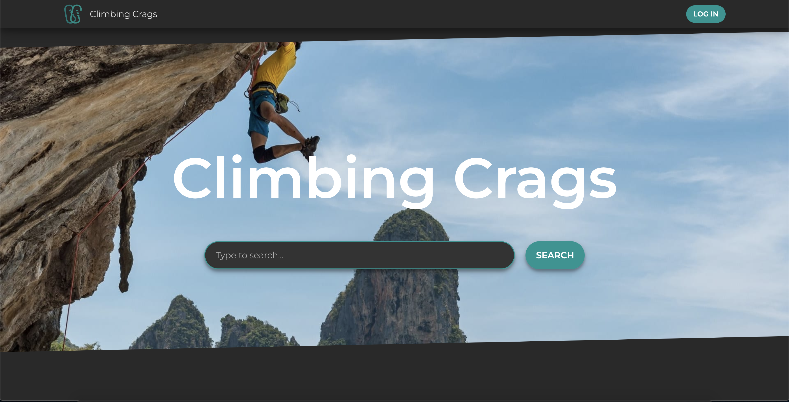

# Climbing Crags

Climbing crags is a simple social platform that works on desktop and mobile, used to search and review climbing routes.

## Screenshots

  

## Getting started

Just visit the deployed version [here](https://climbing-crags.vercel.app/)

## Build with

- [Next.js](https://nextjs.org/) - Backend React framework
  - [Typescript](https://www.typescriptlang.org/) - Strongly typed language for JavaScript
- [TailwindCSS](https://tailwindcss.com/) - CSS framework
- [MongoDB](https://www.mongodb.com/) - Database and Atlas for DB hosting
- [React](https://reactjs.org/) - Main front end framework
  - [Jest](https://jestjs.io/) - JavaScript testing framework
  - [Testing-library/React](https://testing-library.com/) - Testing utilities for React
  - [Cypress](https://www.cypress.io/) - E2E testing for React
- [Cloudinary](https://cloudinary.com/) - Image hosting and resizing

## Cool features

- ### Next Features
  - Server-side rendering for the homepage
  - Static rendering for all the rest of the pages
  - Incremental static regeneration in the routes page that gets triggered when a new comment gets sent
- ### MongoDB

  - Fuzzy search for the homepage
  - Autosuggestion for the search in the homepage

- ### Cloudinary
  - Pre-render of low quality images ~ 30Kb before loading the high quality one

## Author

Samuele Venier - [Github](https://github.com/blade2201) - [LinkedIn](https://www.linkedin.com/in/samuele-venier/)

## Contributors

Matthew D'Agostino - [Github](https://github.com/mattdags982) - [LinkedIn](https://www.linkedin.com/in/matthewgregorydagostino/)
 
Gonzalo Salvador - [Github](https://github.com/sgt-hudson) - [LinkedIn](https://www.linkedin.com/in/gonzalo-salvador/)
